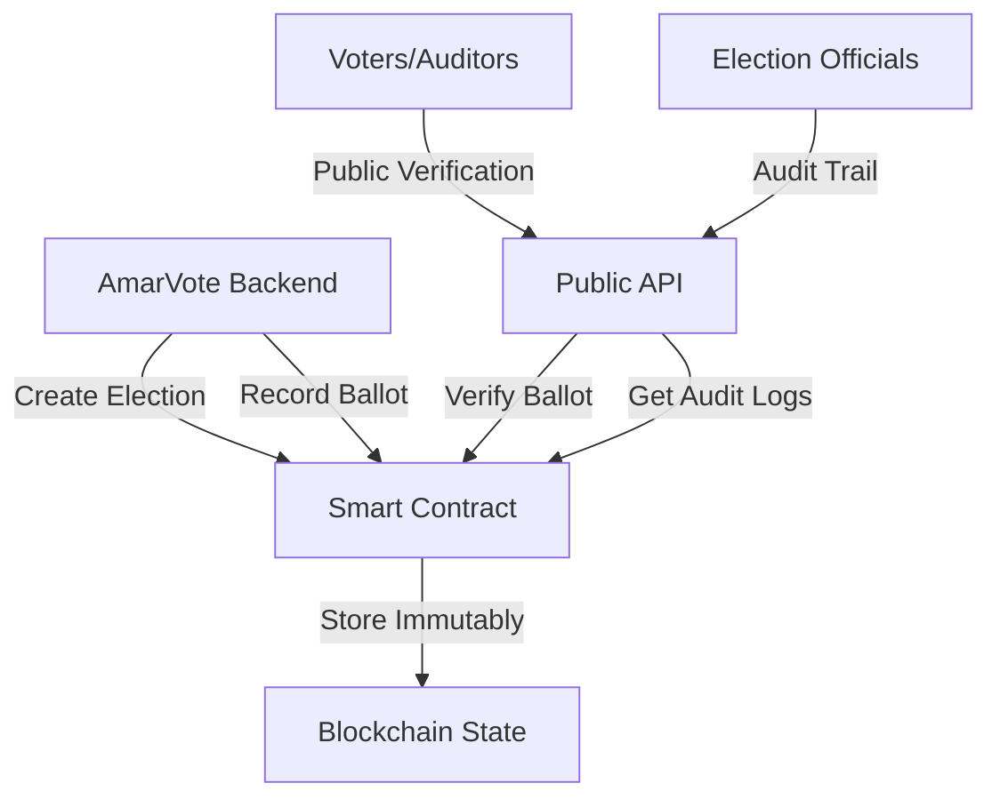

# AmarVote Blockchain Infrastructure

A sophisticated blockchain-based voting system designed to provide immutable, transparent, and verifiable election records using Ethereum technology, Solidity smart contracts, and Python-based microservices.

## System Architecture Overview

The AmarVote blockchain infrastructure consists of **three interconnected components** working in harmony:

### 1. **Ethereum Blockchain Layer (Ganache)**
- **Purpose**: Serves as the immutable distributed ledger for storing all voting records
- **Technology**: Local Ethereum blockchain simulation using Ganache
- **Network Configuration**: Custom network (ID: 1337) with deterministic account generation
- **Consensus**: Proof-of-Authority (PoA) for fast transaction processing
- **Gas Configuration**: Optimized with 6,721,975 gas limit and 20 Gwei gas price

### 2. **Smart Contract Layer (VotingContract.sol)**
- **Technology**: Solidity 0.8.19 with Byzantine EVM compatibility
- **Architecture**: Owner-controlled contract with public verification capabilities
- **Storage Structure**: Nested mappings for election management and ballot tracking
- **Security**: Built-in duplicate prevention and access control mechanisms

### 3. **API Abstraction Layer (Python Flask)**
- **Technology**: Flask microservice with Web3.py integration
- **Purpose**: Provides RESTful API interface for blockchain interactions
- **Middleware**: PoA middleware for network compatibility
- **Connection Management**: Automatic retry logic and connection health monitoring

## What the Blockchain Saves and Why

### **Data Structures Stored On-Chain:**

#### **Ballot Records**
```solidity
struct Ballot {
    string electionId;      // Unique election identifier
    string trackingCode;    // Voter-specific tracking identifier
    string ballotHash;      // Cryptographic hash of ballot content
    uint256 timestamp;      // Block timestamp of recording
    bool exists;           // Existence flag for validation
}
```

#### **Election Logs**
```solidity
struct ElectionLog {
    string message;         // Human-readable event description
    uint256 timestamp;      // Block timestamp of event
}
```

#### **Mapping Structures**
- **Primary Storage**: `mapping(string => mapping(string => Ballot))` - Election ID → Tracking Code → Ballot
- **Tracking Validation**: `mapping(string => mapping(string => bool))` - Prevents duplicate tracking codes
- **Election Registry**: `mapping(string => bool)` - Validates election existence
- **Audit Trail**: `mapping(string => ElectionLog[])` - Comprehensive election activity logs

### **Why This Data Structure:**

1. **Immutability**: Once recorded on blockchain, ballot data cannot be altered or deleted
2. **Verifiability**: Public functions allow anyone to verify ballot existence and integrity
3. **Transparency**: Complete audit trail of all election activities
4. **Security**: Cryptographic hashing ensures ballot content integrity
5. **Traceability**: Unique tracking codes enable individual ballot verification

## How the System Starts and Operates

### **Container Orchestration Sequence:**

1. **Ganache Blockchain Initialization**
   - Launches Ethereum test network on port 8545
   - Generates 10 deterministic accounts using mnemonic seed
   - Establishes network ID 1337 with PoA consensus
   - Configures gas limits and pricing parameters

2. **Smart Contract Deployment**
   - Blockchain-deployer container compiles Solidity contracts using Truffle
   - Deploys VotingContract.sol to Ganache network
   - Copies contract artifacts (ABI, address) to shared volume
   - Sets first Ganache account as contract owner

3. **API Service Startup**
   - Python Flask microservice initializes Web3 connection
   - Loads contract artifacts and establishes contract interface
   - Performs health checks and connection validation
   - Exposes REST endpoints for blockchain interaction

### **Smart Contract Functionality Deep Dive:**

#### **Access Control Architecture**
- **Owner-Only Operations**: `createElection()` and `recordBallot()` - Only the backend system can write data
- **Public Read Operations**: `verifyBallot()`, `getBallotByTrackingCode()`, `getElectionLogs()` - Anyone can verify data
- **Security Modifier**: `onlyOwner()` ensures only the first Ganache account can modify blockchain state

#### **Data Integrity Mechanisms**
- **Duplicate Prevention**: Tracking codes are unique per election through mapping validation
- **Hash Verification**: Ballot content integrity verified through cryptographic hashing
- **Timestamp Immutability**: Block timestamps provide tamper-proof chronological ordering
- **Existence Validation**: Boolean flags prevent false positive queries

## Immutability and Blockchain Guarantees

### **What Makes This System Immutable:**

1. **Cryptographic Security**
   - Each block contains cryptographic hash of previous block
   - Changing any historical data would require recomputing entire chain
   - Hash functions (SHA-256) are computationally infeasible to reverse

2. **Distributed Consensus** (Current: Single Node, Expandable)
   - Currently uses single Ganache node for development
   - Architecture supports multi-node consensus mechanisms
   - Smart contract logic remains identical across network types

3. **Smart Contract Immutability**
   - Once deployed, contract code cannot be modified
   - State changes only possible through predefined functions
   - No administrative backdoors or data deletion capabilities

4. **Audit Trail Completeness**
   - Every ballot recording creates permanent log entry
   - Election creation and all activities are timestamped
   - Complete chain of custody from vote casting to verification

### **Current Limitations of Single-Node Setup:**

⚠️ **Development Environment Constraints:**
- Single point of failure (Ganache node)
- No network resilience against node failure
- Centralized private key management
- Limited to local development scope

## Why Blockchain for Voting

### **Core Advantages:**

1. **Transparency Without Privacy Breach**
   - Public verifiability of ballot existence
   - Content privacy through cryptographic hashing
   - Open audit capability for election integrity

2. **Tamper Evidence**
   - Any attempt to modify records leaves cryptographic evidence
   - Historical immutability ensures election results permanence
   - Mathematically provable data integrity

3. **Decentralized Trust**
   - Removes reliance on single trusted authority
   - Cryptographic proof replaces institutional trust
   - Public verification reduces dispute potential

4. **Complete Audit Trail**
   - Every action timestamped and recorded
   - Full election lifecycle documentation
   - Enables post-election integrity verification

## Advanced Blockchain Integration Possibilities

### **Transition to Production-Grade Blockchain:**

#### **1. Ethereum Mainnet Integration**
```solidity
// Production considerations:
- Gas optimization for cost efficiency
- Layer 2 scaling solutions (Polygon, Arbitrum)
- ENS integration for human-readable addresses
- Multi-signature governance for contract upgrades
```

#### **2. Consortium Blockchain Architecture**
```network
├── Government Nodes (Validators)
├── Election Commission Nodes (Validators)  
├── Civil Society Observer Nodes (Read-only)
└── Public Verification Nodes (Read-only)
```

#### **3. Advanced Cryptographic Integration**
- **Zero-Knowledge Proofs**: Verify vote validity without revealing content
- **Ring Signatures**: Anonymous voting with cryptographic proof of eligibility
- **Threshold Cryptography**: Distributed vote counting requiring multiple parties
- **Homomorphic Encryption**: Mathematical operations on encrypted votes

### **Recommended Production Architecture:**

#### **Hybrid Blockchain Model**
1. **Public Verification Layer** (Ethereum/Polygon)
   - Merkle root hashes of election batches
   - Public audit capabilities
   - Immutable result anchoring

2. **Private Consortium Layer** (Hyperledger Fabric/Quorum)
   - Detailed ballot storage with privacy
   - Permissioned access for election officials
   - Fast transaction processing

3. **IPFS Integration**
   - Decentralized storage for large election data
   - Content-addressed ballot storage
   - Distributed backup and availability

#### **Enhanced Security Features**
```solidity
// Multi-signature governance
contract EnhancedVotingContract {
    mapping(address => bool) public electionOfficials;
    uint256 public requiredSignatures;
    
    modifier requireMultiSig() {
        require(verifyMultipleSignatures(), "Insufficient signatures");
        _;
    }
    
    function recordBallot(...) requireMultiSig public {
        // Ballot recording with multi-party approval
    }
}
```

### **Scalability Enhancements:**

#### **Layer 2 Solutions**
- **State Channels**: Off-chain vote aggregation with periodic settlement
- **Sidechains**: Dedicated voting chains with mainnet anchoring
- **Rollups**: Batch transaction processing with cryptographic proofs

#### **Sharding Implementation**
- **Geographic Sharding**: Regional election chains
- **Temporal Sharding**: Time-based election separation
- **Functional Sharding**: Different election types on separate chains

## Current System Strengths and Upgrade Path

### **Existing Foundation Strengths:**
✅ **Solid Smart Contract Architecture** - Well-structured, secure, and extensible
✅ **Comprehensive API Layer** - RESTful interface with proper error handling
✅ **Docker Containerization** - Portable and scalable deployment
✅ **Event Logging System** - Complete audit trail capability
✅ **Multi-language Integration** - Solidity contracts with Python API

### **Immediate Upgrade Opportunities:**

1. **Network Decentralization**
   - Replace Ganache with multi-node test network
   - Implement validator node distribution
   - Add network resilience and fault tolerance

2. **Advanced Cryptography Integration**
   - Implement zero-knowledge proof verification
   - Add threshold signature schemes
   - Enhance privacy-preserving mechanisms

3. **Governance Enhancement**
   - Multi-signature contract administration
   - Decentralized governance protocols
   - Transparent upgrade mechanisms

4. **Performance Optimization**
   - Layer 2 scaling solution integration
   - Batch processing capabilities
   - Gas cost optimization

The current blockchain infrastructure provides a robust foundation that can seamlessly scale from development to production-grade decentralized voting systems while maintaining the core principles of transparency, immutability, and verifiability.

## Quick Start and System Deployment

### **Development Environment Setup**

⚠️ **Note**: The blockchain components are currently commented out in docker-compose.yml but can be enabled for development.

To activate the complete blockchain system:

1. **Uncomment blockchain services** in docker-compose.yml:
   ```yaml
   ganache:
     image: trufflesuite/ganache:latest
   
   blockchain-deployer:
     build: ./blockchain
   
   voting-api:
     build: ./blockchain-microservice
   ```

2. **Start the system**:
   ```bash
   docker-compose up -d
   ```

3. **System startup sequence**:
   - Ganache blockchain initializes on port 8545
   - Smart contracts deploy automatically
   - Flask API service starts on port 5002
   - System ready for API calls within 30 seconds

### **Health Check and Verification**
```bash
# Check system health
curl http://localhost:5002/health

# Expected response:
{
  "status": "healthy",
  "blockchain": "connected",
  "contract": "loaded",
  "contract_address": "0x..."
}
```

## Complete API Reference

### **1. System Health Check**
```http
GET /health
```
**Purpose**: Monitor blockchain connectivity and contract status  
**Access**: Public  
**Response**:
```json
{
  "status": "healthy",
  "blockchain": "connected|disconnected", 
  "contract": "loaded|not loaded",
  "contract_address": "0x..."
}
```

### **2. Election Management**

#### **Create New Election**
```http
POST /create-election
Content-Type: application/json

{
  "election_id": "presidential-2024-001"
}
```
**Purpose**: Initialize a new election on blockchain  
**Access**: Backend only (owner account)  
**Blockchain Action**: Creates election registry entry and initial log  
**Response**:
```json
{
  "status": "success",
  "message": "Election created successfully",
  "election_id": "presidential-2024-001",
  "transaction_hash": "0x...",
  "block_number": 123,
  "timestamp": 1703123456
}
```

### **3. Ballot Operations**

#### **Record Ballot (Immutable Write)**
```http
POST /record-ballot
Content-Type: application/json

{
  "election_id": "presidential-2024-001",
  "tracking_code": "TRK-ABC123XYZ",
  "ballot_hash": "sha256:a1b2c3d4e5f67890abcdef1234567890"
}
```
**Purpose**: Permanently record encrypted ballot on blockchain  
**Access**: Backend only (owner account)  
**Security**: Validates election existence and tracking code uniqueness  
**Immutability**: Once recorded, ballot cannot be modified or deleted  
**Blockchain Effects**:
- Creates permanent ballot record
- Generates audit log entry
- Emits BallotRecorded event

#### **Verify Ballot (Public Verification)**
```http
GET /verify-ballot?election_id=presidential-2024-001&tracking_code=TRK-ABC123XYZ&ballot_hash=sha256:a1b2...
```
**Purpose**: Public verification of ballot existence and integrity  
**Access**: Public (anyone can verify)  
**Cryptographic Validation**: Compares provided hash with stored hash  
**Response**:
```json
{
  "status": "success",
  "result": {
    "exists": true,
    "timestamp": 1703123456,
    "election_id": "presidential-2024-001",
    "tracking_code": "TRK-ABC123XYZ",
    "ballot_hash": "sha256:a1b2..."
  }
}
```

#### **Ballot Information Lookup**
```http
GET /ballot/{election_id}/{tracking_code}
```
**Purpose**: Retrieve comprehensive ballot information  
**Access**: Public  
**Use Case**: Voter verification and audit procedures  
**Response**:
```json
{
  "status": "success",
  "result": {
    "exists": true,
    "election_id": "presidential-2024-001",
    "ballot_hash": "sha256:a1b2...",
    "timestamp": 1703123456,
    "tracking_code": "TRK-ABC123XYZ"
  }
}
```

### **4. Audit and Transparency**

#### **Election Audit Logs**
```http
GET /get-logs/{election_id}
```
**Purpose**: Complete audit trail for election transparency  
**Access**: Public  
**Contains**: All election activities with timestamps  
**Response**:
```json
{
  "status": "success",
  "result": {
    "election_id": "presidential-2024-001",
    "log_count": 1503,
    "logs": [
      {
        "message": "A new election with election-id = presidential-2024-001 is created at 1703123400",
        "timestamp": 1703123400,
        "formatted_time": "2024-01-15 10:30:00 UTC"
      },
      {
        "message": "A new ballot with tracking code = TRK-ABC123XYZ, ballot-hash = sha256:a1b2... has been cast at 1703123456",
        "timestamp": 1703123456,
        "formatted_time": "2024-01-15 10:30:56 UTC"
      }
    ]
  }
}
```

## Real-World Usage Examples

### **Backend Integration Example**
```python
import requests
import hashlib
import json

# Create election
election_data = {"election_id": "municipal-2024-NY"}
response = requests.post("http://localhost:5002/create-election", 
                        json=election_data)
print(f"Election created: {response.json()}")

# Record ballot
ballot_content = {"candidate": "John Doe", "voter_id": "encrypted"}
ballot_hash = hashlib.sha256(json.dumps(ballot_content).encode()).hexdigest()

ballot_data = {
    "election_id": "municipal-2024-NY",
    "tracking_code": "NYC-001-TRK789", 
    "ballot_hash": f"sha256:{ballot_hash}"
}
response = requests.post("http://localhost:5002/record-ballot", 
                        json=ballot_data)
print(f"Ballot recorded: {response.json()}")
```

### **Public Verification Example**
```javascript
// JavaScript voter verification interface
async function verifyMyBallot(electionId, trackingCode, originalBallot) {
    // Hash the original ballot content
    const encoder = new TextEncoder();
    const data = encoder.encode(JSON.stringify(originalBallot));
    const hashBuffer = await crypto.subtle.digest('SHA-256', data);
    const hashArray = Array.from(new Uint8Array(hashBuffer));
    const ballotHash = 'sha256:' + hashArray.map(b => 
        b.toString(16).padStart(2, '0')).join('');
    
    // Verify on blockchain
    const verifyUrl = `http://localhost:5002/verify-ballot?` +
        `election_id=${electionId}&tracking_code=${trackingCode}&` +
        `ballot_hash=${ballotHash}`;
    
    const response = await fetch(verifyUrl);
    const result = await response.json();
    
    if (result.result.exists) {
        console.log("✅ Ballot verified on blockchain!");
        console.log(`Recorded at: ${new Date(result.result.timestamp * 1000)}`);
    } else {
        console.log("❌ Ballot not found or hash mismatch");
    }
}
```

## System Architecture and Security Model

### **Trust and Security Assumptions**

#### **Current Development Security Model**
- **Single Authority**: Backend system controls ballot recording through owner account
- **Public Verification**: Anyone can verify ballot existence and integrity  
- **Cryptographic Integrity**: Hash-based content verification ensures data immutability
- **Audit Transparency**: Complete public access to election activity logs

#### **Production Security Enhancements Needed**
- **Multi-signature Authority**: Require multiple parties to approve ballot recording
- **Threshold Key Management**: Distribute critical operations across multiple entities
- **Hardware Security Modules**: Secure key storage and cryptographic operations
- **Network Decentralization**: Remove single point of failure from blockchain infrastructure

### **Data Flow Architecture**



### **Smart Contract Security Features**

1. **Access Control Enforcement**
   - Only owner can write election data
   - Public can read all verification data
   - No backdoors for data modification

2. **Data Validation**
   - Non-empty field validation
   - Unique tracking code enforcement
   - Election existence verification

3. **Event Emission**
   - All critical operations emit events
   - Enables external monitoring
   - Provides transaction receipts

4. **Gas Optimization**
   - Efficient mapping structures
   - Minimal storage operations
   - Optimized compilation settings

## Technical Requirements and Deployment

### **System Requirements**

#### **Development Environment**
- **Docker Engine**: 20.10+
- **Docker Compose**: 2.0+
- **Available Ports**: 8545 (Ganache), 5002 (API)
- **Memory**: Minimum 2GB RAM for all containers
- **Storage**: 1GB free space for blockchain data

#### **Production Environment**
- **Ethereum Node**: Full node or Infura/Alchemy API
- **Load Balancer**: For API scaling and redundancy
- **Database**: PostgreSQL for API metadata caching
- **Monitoring**: Prometheus/Grafana for blockchain metrics
- **SSL/TLS**: Certificate management for secure API access

### **Network Configuration**
- **Ganache Network ID**: 1337
- **Gas Limit**: 6,721,975
- **Gas Price**: 20 Gwei
- **Block Time**: ~2 seconds (development)
- **Account Generation**: Deterministic with mnemonic seed

### **Deployment Architecture**

#### **Container Services**
```yaml
services:
  ganache:           # Ethereum blockchain simulation
  blockchain-deployer: # Smart contract deployment
  voting-api:        # RESTful API interface
```

#### **Volume Management**
```yaml
volumes:
  contract-artifacts: # Shared contract deployment data
  voting-data:       # Persistent blockchain data
```

#### **Network Security**
```yaml
networks:
  voting-network:    # Isolated container network
  election_net:      # Integration with main application
```

## Monitoring and Troubleshooting

### **Health Monitoring**

#### **Blockchain Health Indicators**
- **Web3 Connection Status**: Connected/Disconnected
- **Contract Deployment Status**: Loaded/Not Loaded  
- **Transaction Success Rate**: > 95%
- **Block Production Rate**: Consistent timing
- **Gas Usage Trends**: Within expected ranges

#### **API Performance Metrics**
- **Response Times**: < 500ms for verification
- **Error Rates**: < 1% for valid requests
- **Throughput**: Ballots per second capability
- **Memory Usage**: Container resource consumption

### **Common Issues and Solutions**

#### **Connection Issues**
```bash
# Check Ganache connectivity
curl http://localhost:8545

# Verify container network
docker network ls
docker network inspect voting-network
```

#### **Contract Deployment Issues**
```bash
# Check deployment logs
docker logs blockchain-deployer

# Verify contract artifacts
docker exec voting-api ls -la /app/contracts/
```

#### **API Service Issues**
```bash
# Check API health
curl http://localhost:5002/health

# View API logs
docker logs voting-api
```

### **Performance Tuning**

#### **Ganache Optimization**
- Increase account count for load testing
- Adjust gas limits for complex operations
- Configure memory limits for stability

#### **API Scaling**
- Implement connection pooling
- Add Redis caching layer
- Configure horizontal pod scaling

## Future Development Roadmap

### **Phase 1: Security Hardening**
- [ ] Multi-signature wallet implementation
- [ ] Role-based access control
- [ ] Audit trail encryption
- [ ] Penetration testing

### **Phase 2: Scalability Enhancement**  
- [ ] Layer 2 integration (Polygon/Arbitrum)
- [ ] State channel implementation
- [ ] Batch transaction processing
- [ ] Load balancing configuration

### **Phase 3: Advanced Features**
- [ ] Zero-knowledge proof integration
- [ ] Anonymous voting protocols
- [ ] Cross-chain compatibility
- [ ] Governance token implementation

### **Phase 4: Production Deployment**
- [ ] Mainnet contract deployment
- [ ] Regulatory compliance audit
- [ ] Disaster recovery procedures
- [ ] 24/7 monitoring setup

The AmarVote blockchain infrastructure represents a solid foundation for secure, transparent, and verifiable digital voting, with clear pathways for evolution into a production-grade decentralized system that can maintain election integrity at scale while preserving voter privacy and enabling public auditability.
